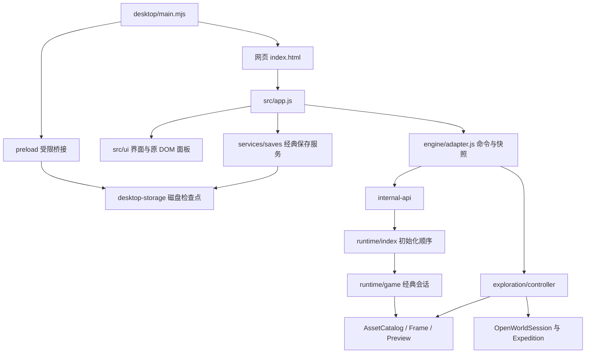

# 当前架构

本文件说明当前工作树的系统边界。规模、版本与本轮验证只在 [WORKSTATE](WORKSTATE.md) 维护；具体债务见 [architecture-debt](architecture-debt.md)。原恢复阶段的详细考古和迁移卡在 [历史架构](history/classic-architecture-before-governance.md)，其中旧行号/属性名不是当前接口。

## 运行路径与所有权

产品界面经 `adapter.js` 访问引擎，得到显示快照或操作入口。`services/save-validation.js` 直接使用独立 codec 做验证，这是存档服务职责，不是游戏状态旁路。原 DOM 面板仍属 `engine/modules/views`，保留外部选择器契约。

经典 `game` 持有 `state`、世界/地牢/城堡注册表、战斗/掉落容器、素材目录、视图、循环和保存管理器。`runtime/index.js` 调用 74 个 `initialize*`，原型/定义表初始化和 `bind*` 顺序由专门门禁锁定。显式输入接口已经减少直连，**仍存在大循环依赖**；初始化顺序保证可运行，没有消除静态导入环。

原野不是经典世界地图的换皮。controller 新建独立 OpenWorldSession，读取经典队伍的显示名和图像建立观赏成员；自然生成器、探索时钟、资源、个人背包、已采位图与仓库属于原野状态，不写经典存档或消费经典 RNG。

## 启动与故障

`app.boot()` 挂载面板，选择网页或桌面存储，准备经典记录，调用 adapter boot；桌面启动可预先暂停经典。首次循环等待图片加载，初始化内容/世界，恢复经典记录或回退到空白世界，再建立视图。产品按是否已开局/胜利导航，观赏场景通过 controller 管理自身生命周期。

经典模拟和绘制分开捕获异常：模拟失败记录 `loop.simulationFault` 并经 `fault-port` 上报，阻止继续模拟和自动存档；渲染错误保留现有日志且继续调度。它不是所有错误统一忽略/无限重试。原野恢复错误阻止覆盖旧记录，临时会话仍可显示；详见 [持久化](persistence.md)。

## 模块职责

| 路径 | 职责 |
|---|---|
| `src/engine/modules/core`、`content` | 数学/布局/HTML 文本边界，经典内容定义；内容数组顺序承重 |
| `characters`、`ai`、`combat`、`simulation` | 角色/行为/战斗和经典回合推进；正常每回合 250ms |
| `world`、`loot`、`progression` | 经典地图生成、掉落、升级/成就/统计 |
| `persistence`、`runtime` | 旧 DTO 读写、会话组合、初始化、存储和故障宿主端口 |
| `rendering` | 资源解析、归一帧、显示动画、地图投影/排序和 Canvas 绘制 |
| `src/engine/exploration` | 原野地貌/分块、导航、发现历史、采集/返程/仓库及原野 Renderer |
| `src/services`、`src/ui` | 存档校验/存储实现、界面编排/面板；经济规则不放 UI |
| `desktop` | Electron 主进程/预加载/打包；受限协议、窗口/托盘和磁盘提交 |
| `assets`、`src/data/assets.generated.js` | 素材包与开发期派生清单；运行时不扫描目录 |
| `content-prep`、`tools/content-prep` | 未接线经济草案与独立工具；生产源码不反向导入 |
| `archive/original`、`archive/migration` | 原版验证参照与恢复清单；产品构建不加载原版脚本 |
| `scripts`、`tests` | 构建/校验/生成脚本与单测、差分场景和 harness；不属产品运行时，命令入口与编译配置在 `package.json`、`tsconfig.json` |
| `docs`、`CONTEXT.md`、根级 README 与四份报告 | 文档索引与维护规则见 [docs/README](README.md)；四份报告承载验收/兼容/性能/迁移证据 |
| `spritesheet`、`images` | 原版经典素材与档案运行依赖（`archive/original` 引用 `images/Transparent.gif`） |
| `artifacts` | 机读审计产物与素材来源归档；`assets/vendor/SOURCES.json` 引用 `artifacts/vendor-assets/downloads` |
| `index.html`、`favicon.svg`、`启动桌面试用.cmd` | 网页入口与桌面试用启动脚本 |
| `output`、`dist`、`node_modules` | 本地生成物与依赖，不入库；忽略规则见根目录 `.gitignore` |

新增顶层目录或调整上述归属时同步更新本表，并跑 `npm run lint` 与 `npm run check` 复核。

## 显示与行为边界

classic 是原版逐像素验证路径；clean 是经授权的产品表现，保留原素材色彩并处理 DPR/动态接缝。帧播放状态使用 WeakMap，不写实体存档；世界坐标、碰撞和寻路属于规则，图片尺寸/锚点/footprint 只描述显示。旧特效推进还参与战斗时长，不能将装饰动画直接替换规则时钟。

投影、资源协议和实际未完成范围分别见 [rendering](rendering.md)、[素材接口设计](ASSET-RENDERING-UPGRADE.md)、[素材导入教程](../assets/README.md)、[原野](OPEN-WORLD.md)。经典/原野/桌面的时间和记录边界见 [time-model](time-model.md)、[persistence](persistence.md)。

## 扩展方式

经典重构以真实状态所有权和小型深接口切片：稳定容器可绑定引用，被替换状态用实时 getter；保留初始化、缓存求值、RNG、存档和 DOM 契约并做差分。原野经济先定正式数据源、稳定身份和计量，再做一个有事务与恢复验证的制作闭环。不能为减少 SCC/导入数字增加空转发层，也不能因原野目标而改写经典 oracle。
