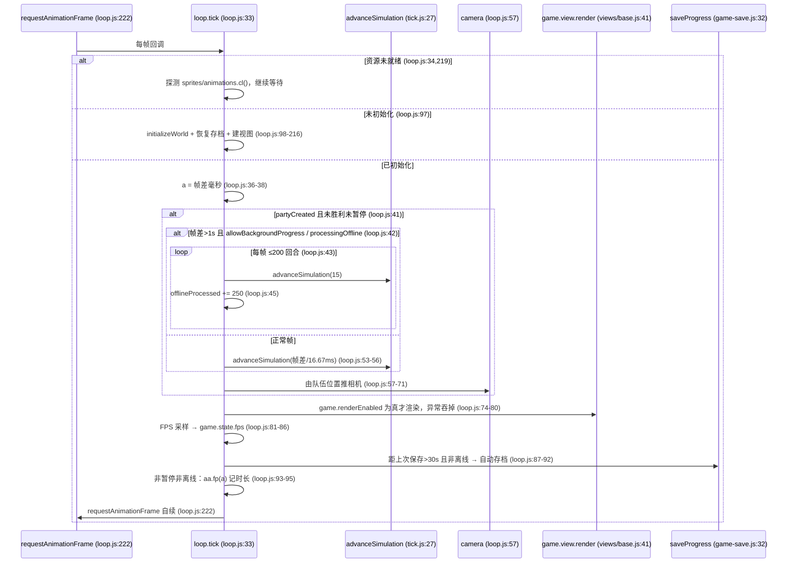
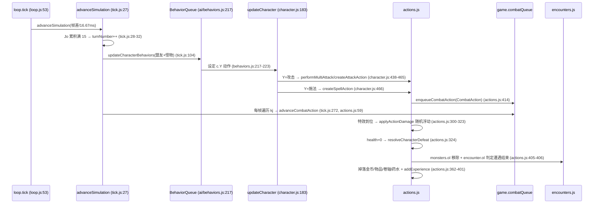
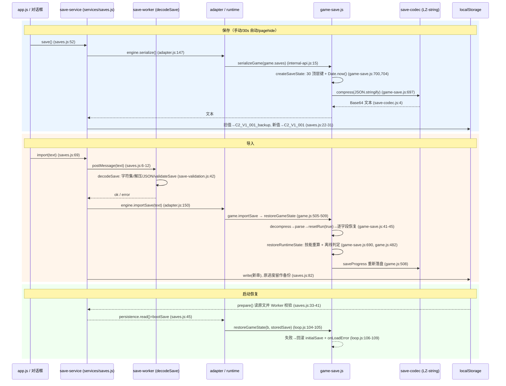
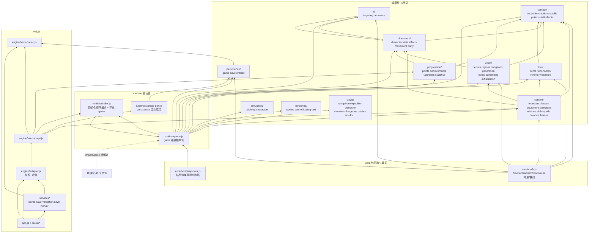

# Clickpocalypse II 语义恢复工程 · 架构文档

> 本文记录恢复期的 15 个架构问题与代码证据；部分散文和行号仍是 2026-09-27 快照，完整现代化的当前指标以 `docs/modernization-status.md` 与 `npm run audit:arch -- --json` 为准。
> 已验证的底层事实（RNG 变体、存档 4477 键、离线上限等）不再重复论证，见 `docs/reverse-engineering/facts.md`。
> 语义符号对照见 `docs/symbol-map.json`；本文沿用重构后的符号名，必要处标注原缩写字段。
>
> **已知缺口（写明，2026-09-27 复核）**：本文有 31 处反引号内的短标识符在当前 `src/` 里已找不到
> （`scripts/` 的扫描脚本：`output/scan-doc-ids.mjs`，口径见下）。已知类别：
> ① 统计记录器的方法别名（`aa.is/es/cp/fp/Ur/Xr/Rr/hs/jx` 等，现名形如 `recordTurn/recordDirectKill`，
> 逐条对应关系**未取证**，故未改）；② 装备定义表的字面量键（`fa/oa/na/ma/la`）；
> ③ 少量局部参数与生成器字段（`Aj/Mb/Mk/Uj/cl/wa/sr` 等）；④ 图节点名与英文单词的误报（`SIM/R/L/k/t/def`）。
> 补齐工具 `scripts/fix-doc-identifiers.mjs`（2026-09-27 已增强：散文里反引号包裹的 `obj.X` 形态也会同步），
> 未取证的名字**不臆造替换**。架构债台账与下一步候选见 `docs/architecture-debt.md`。

---

## 0. 总体分层

```
浏览器 (index.html)
  └─ src/app.js（新 UI 壳，唯一 <script type=module> 入口）
       ├─ src/ui/*           新 UI 组件（dashboard、party-builder、legacy-panels）
       ├─ src/services/*     存档校验/Worker/localStorage 服务
       └─ src/engine/adapter.js   产品层唯一引擎入口（快照 + 命令）
            └─ src/engine/internal-api.js  内部接口（恢复引擎对象）
                 └─ src/engine/modules/runtime/index.js  模块初始化编排 + game 导出
                      └─ src/engine/modules/runtime/game.js  组合根（game 单例）
                           └─ src/engine/modules/{core,content,world,combat,loot,characters,ai,simulation,progression,rendering,persistence,views}
```

---

## 1. 页面从加载到进入游戏经过哪些步骤？

1. `index.html:12` 以 ES module 加载 `./src/app.js`（无其他脚本入口）。
2. `src/app.js:119-142` `boot()` 依次执行：
   - `:120` 渲染图标；`:121` `loadGamePanels()` 把 `src/ui/panels/*.html`（含 shell + 5 份 character 模板）注入 `#legacy-host`（`src/ui/load-panels.js:9-14`）；
   - `:123` `saves.prepare()`：读 localStorage 原始串并交 Worker 校验（`src/services/saves.js:33-41`）；
   - `:124` `engine.boot(saves.persistence)`；
   - `:127-129` 创建组队构建器、绑定事件、增强遗留控件；
   - `:130-131` 隐藏 loading、显示应用；`:132` 按 `won/expedition` 导航；
   - `:135-141` 启动 300ms 轮询：监测 `started/won/offline` 变化并调用 `refresh()`。
3. `src/engine/adapter.js:20-30` `engine.boot`：`runtime.setPersistence(persistence)` 注入存储端口（`:21`），调 `game.onLoad()`（`:22`），然后轮询等待 `game.view.panels.length` 非空且（未开局时）DOM 出现 `#startQuestButton`，15 秒超时报错（`:24-27`）。
4. `src/engine/modules/runtime/game.js:200-203` `game.onLoad()` = `bindVisibility()`（visibilitychange → `renderEnabled`）+ `game.loop.tick()` 启动帧循环。
5. 帧循环 `GameLoop.prototype.tick`（`src/engine/modules/simulation/loop.js:33`）分三态：
   - 资源未就绪：`resourcesReady = monsterSprites/terrainSprites/itemSprites/animations 的 .cl()`（`:219`），每帧重试并继续 `requestAnimationFrame`（`:222`）；
   - `game.initialized` 为假（首次）：执行一次性初始化分支（见下）；
   - 已初始化：正常模拟 + 渲染（见第 3/4 节）。
6. 首次初始化分支（`loop.js:97-217`）：`game.initializeWorld()`（`:98`，填充怪物目录、物品目录、宝箱定义、区域与城堡，`game.js:204-350`）→ 先序列化一份空白存档 `initialSave`（`:102`）→ 尝试 `persistence.read()` + `restoreGameState`，失败则回滚到 `initialSave` 并回调 `onLoadError`（`:103-109`，保证坏档不破坏可用状态）→ 构建 15 个 Tab/Panel 视图并挂载（`:112-207`）→ 已有队伍则 `view.reset()`，离线中则 `onOfflineStart()`，已胜利则 `onGameWon()`（`:208-216`）。
7. 模块级初始化（构造器原型、内容表）由 `src/engine/modules/runtime/index.js:77-165` 按固定顺序调用 74 个 `initialize*()`，最后 `initializeRuntimeGame()`（`:165`）创建 `game` 组合根，`:166` 再导出 `game`。注释明确"模块初始化阶段只有这里拥有调用顺序"（`:76`）。

### startup sequence

```mermaid
sequenceDiagram
    participant B as 浏览器 index.html
    participant A as app.js boot()
    participant S as services/saves.js
    participant E as adapter.js engine
    participant G as game.js (game 单例)
    participant L as loop.js GameLoop

    B->>A: module 加载并执行 boot() (app.js:119)
    A->>A: loadGamePanels() 注入面板 DOM (app.js:121)
    A->>S: saves.prepare() Worker 校验 localStorage (app.js:123, saves.js:33)
    A->>E: engine.boot(persistence) (app.js:124)
    E->>E: runtime.setPersistence(persistence) (adapter.js:21)
    E->>G: game.onLoad() (adapter.js:22, game.js:200)
    G->>G: bindVisibility() renderEnabled 开关 (game.js:197)
    G->>L: game.loop.tick() (game.js:202)
    L->>L: 资源未就绪? 每帧探测 .cl() (loop.js:219)
    L->>G: 首帧: initializeWorld() (loop.js:98, game.js:204)
    L->>L: serializeGame(空白档) 作回滚底 (loop.js:102)
    L->>L: persistence.read() + restoreGameState, 失败回滚 (loop.js:103-109)
    L->>L: 构建 15 个 Tab/Panel 视图 (loop.js:112-207)
    L->>L: requestAnimationFrame 自续 (loop.js:222)
    E->>E: 轮询等待 panels + #startQuestButton (adapter.js:24-27)
    E-->>A: boot 返回; 新档默认关 showFps (adapter.js:29)
    A->>A: createPartyBuilder / bind / navigate (app.js:127-132)
    A->>A: 300ms 轮询 engine.snapshot() 刷新 UI (app.js:135-141)
```

---

## 2. GameState 的所有者是谁？

**所有者是 `src/engine/modules/runtime/game.js` 导出的模块级单例 `game`**（组合根）：

- `game.js:39` `export var game;`，由 `initializeRuntimeGame()`（`game.js:40-537`）一次性赋值；该函数只在 `runtime/index.js:165` 被调用一次。
- 可序列化的"游戏状态"集中在 `game.state`（`game.js:146-191`）：`turnNumber`、`frameNumber`、`encounter`（`EncounterState`）、`party`（`PartyState`）、`adventurers`、`adventurePoints`（点数/升级）、`achievements`、`runStatistics`、`lifetimeStatistics`、`aa`（StatisticsRecorder）、`victoryStatistics`、`victoryCount`。
- 会话级子系统直接挂在 `game` 上：`world`（WorldMap）、`monsters`/`minions`/`allies` 注册表、`dungeons`/`farms`/`shops`、`level`（DungeonLevel）、`loop`（GameLoop，`:88`）、`view`（GameView，`:89`）、`options`、各掉落/物品/卷轴/药水注册表、`saves`（saveKey=`C2_V1_001`、`autoSaveInterval=3E5`，`:136-142`）。
- 传播方式：**43 个文件**直接导入 `runtime/game.js`，其中 **42 个**真正绑定 `game`（Babel 解析实测，2026-09-28）。目录分布：`views 11、world 8、characters 4、combat 4、progression 3、rendering 3、simulation 3、ai 2、loot 2、persistence 2、runtime 1`。即**状态所有权在 runtime，仍有大量域模块通过活绑定共享同一个 `game`**；`runtime/index.js:166` 的再导出与 `internal-api.js:11` 的 `runtime.game` 让适配层拿到同一实例。
- 循环依赖的成立方式：`game.js` 反向 import 域模块的构造器（`game.js:4-38`），部分域模块 import `game`。因 `export var game` 提升 + 域模块只在函数执行期访问 `game`，而 `initializeRuntimeGame()` 在所有模块初始化的最后执行，构建时序由 `runtime/index.js:76-165` 的调用顺序保证。
- **实测形状（2026-09-27，`npm run audit:arch`）**：`src` 下 93 个 `.js`（其中 `engine/modules` 77 个）、564 条 import 边；强连通分量（SCC）**只有 1 个、含 55 个模块**，覆盖除 `core/` 外的全部域目录——即循环依赖**不是若干小环，而是一整个大环**，"目录拆分 = 依赖方向单一"在这里不成立。初始化顺序方面：74 个 `initialize*()` 调用里有 **41 条初始化期真正执行的跨模块依赖**（其中 18 条来自组合根 `initializeRuntimeGame`），且**没有一条**违反声明顺序 ⇒ 该顺序是这 41 条边的一个合法拓扑序，属承重契约。
- `core/` 是唯一不依赖 `game` 的目录（`core/math.js`、`core/bootstrap-data.js` 无 game import，grep 实测），提供纯函数与数据。

---

## 3. 主循环在哪里？

**主循环 = `GameLoop`（`src/engine/modules/simulation/loop.js`）的自续 `requestAnimationFrame` 帧循环。**

- 构造器 `loop.js:20-31`：`resourcesReady=false`；`frameDuration = 1E3/60`（60Hz 帧假设，`:24`，与 `core/math.js:149` 的 `FRAME_DURATION_MS` 一致）；`turnDuration = 250`（一回合 250ms，`:25`）；`requestTick` 闭包（`:27-29`）。
- `GameLoop.prototype.tick` 在 `initializeSimulationLoop()` 中定义（`loop.js:33`），每帧末尾 `requestAnimationFrame(this.requestTick)` 自续（`:222`）。
- 入口：`game.onLoad()` → `game.loop.tick()`（`game.js:202`）；测试 harness 也直接调 `game.loop.tick()`（`tests/engine-harness.js:30,36`）。
- 每帧的调度规则（`loop.js:41-96`）：
  - 仅当 `game.partyCreated && !game.gameWon && !game.paused` 才推进模拟（`:41`）；
  - 离线分支（`:42-51`，详见第 12 节）；否则 `advanceSimulation(帧差/frameDuration)`（`:53-56`）；
  - 随后更新相机（`:57-71`）、渲染（`:74-80`）、FPS 统计写入 `game.state.fps`（`:81-86`）、30 秒自动存档（离线时跳过，`:87-92`）、非暂停时给统计器记时长 `aa.fp(a)`（`:93-95`）。

### main-loop sequence




---

## 4. simulation 与 render 如何耦合？

**两者在同一 `tick` 内顺序执行，由 `renderEnabled` 布尔开关解耦；渲染失败被 try/catch 吞掉，不影响模拟。**

- `loop.js:53-56`：模拟推进量 = 实际帧差 / `frameDuration`（可 >1 帧），`advanceSimulation(c)`；
- `loop.js:74-80`：`if (game.renderEnabled) { try { game.view.render(); } catch (l) { console.log(...) } }`——渲染异常只记日志（原版行为保留）；
- `renderEnabled` 唯一写点是 `handleVisibility`：`game.renderEnabled = !document.hidden`（`game.js:192-196`），由 `bindVisibility` 在 visibilitychange 时触发（`game.js:197-199`）。即后台标签页跳过渲染但不跳过模拟（配合后台离线分支）；
- `game.view.render()` 来自视图基类：`View.prototype.render` → 可见性切换 + `update()`；`CompositeView.update` → 递归 `render()` 所有子视图（`src/engine/modules/views/base.js:41-64`）。`GameView.prototype = new CompositeView()`（`views/navigation.js:87`），子视图含 `GameCanvasView`（画布渲染，`views/expedition.js:223` + `rendering/scene.js`）；
- 反向耦合（UI → 模拟）：适配层 `showPanel` 会主动调一次 `game.view.render()` 立即重绘（`adapter.js:125-131`）；暂停只停模拟不停渲染（`:41` 的门条件不含渲染）。

---

## 5. UI 如何读取/修改 state？（快照 + 命令）

**产品 UI 不直接持有 `game`；只通过 `src/engine/adapter.js` 的只读快照 `snapshot()` 与校验过的命令方法交互。**

- `adapter.js:18` 注释明示"产品层的唯一引擎入口：校验命令并提供只读显示快照"；`internal-api.js:9` 注释"产品仅通过 adapter.js 的快照与命令访问"。
- 读取：`engine.snapshot()`（`adapter.js:72-125`）每 300ms 被 `app.js:135-141` 拉取，产出扁平展示模型（`ready/started/paused/won/offline/turn/run/gold/kills/heroes[]/options` 等），例如 `gold: game.state.party.gold`（`:81`）、`inCombat: !game.state.encounter.noMonstersLeft`（`:88`）、英雄属性经 `runtime.statValue` 折算（`:104-108`）。新 UI `src/ui/dashboard.js:14-44` 只消费这个快照渲染 DOM。
- 命令（写入路径）：
  - `startParty(party)`（`adapter.js:51-70`）：校验数量/解锁/重名后，调用视图上**与遗留开始按钮共用**的唯一创建入口 `PartyCreationView.prototype.startParty(members)`（`views/party-creation.js` 的 `startParty` → `createAdventurerPartyFromSelection`，U132；产品命令不再直写 `selectedCharacters`/`validParty`，也不再调用 `startButton.onclick()` 这个 DOM 回调），最后 `game.paused = false`；
  - `pause(value)`（`:133-135`）、`setOption(name, enabled)`（`:136-147`，白名单映射到 `game.options` 六个字段）；
  - `showPanel(id)`（`:126-132`）、`serialize()/importSave()/reset()`（`:148-156`）。
- `src/app.js` 的使用点：`navigate` 读快照并 `engine.showPanel`（`app.js:35,49-51`）、暂停按钮 `engine.pause`（`:84`）、设置项 `engine.setOption`（`:108`）、存档服务经 `engine.serialize/importSave/reset`（`src/services/saves.js:55,74,76,92`）。
- 遗留面板（引擎 views/*）仍直接操作 DOM 与 `game`，新 UI 通过 `mountExpedition()` 搬运节点、`enhanceLegacyControls()` 增强键盘可达性（`src/ui/legacy-panels.js:3-13,16`）。

---

## 6. encounter 如何开始？

- 状态：`EncounterState`（`combat/encounters.js:19-24`）——`noMonstersLeft=true` 表示"无遭遇"；`beginEncounter(name, isBoss)`（`:32-38`）置 `noMonstersLeft=false` 并累加计数 `encounterCount`。
- **`populateEncounter(room)`（`encounters.js:39-106`）是唯一批量刷怪入口**，仅在 `noMonstersLeft` 时生效（`:41`），按房间类型 `room.encounterType` 分派（`encounterType` 的 0/1/2 三分支行为如下所示；"野外/城堡"标签为按行为推断的语义命名——待验证：未在代码中找到 `encounterType` 赋值处的命名证据）：
  - `Yp===0`（野外房间）：`bossEncounterModifier` 生效时 20% 概率（`0.2 > Math.random()`，`:44-45`）改走地下城 Boss；否则怪物数 `minMonsters + randomInt(max-min) + extraMonsters`（`:47-51`），等级在怪物目录解锁区间 `[hd, fc]` 内随机（`:52`），经 `getMonsterTypesForLevel` 取 20 只一组的类型缓存（`:52`，`:220-242`），逐只 `new Character("Monster", MONSTER_TYPE, 12, monsterClass, null)`（`:56`）、挂 `AttackBehavior`（`:61`）、按类型成长曲线填六维（`:64-77`）、在房间内随机落位（`:78-83`）、压入 `game.monsters.activeMonsters`（`:84`），最后 `beginEncounter(...)`（`:86`）；
  - `Yp===1`（城堡房间）：`spawnCastleGuardians(count, room)`（`:96`，实现 `:147-163`，从 `content/guardians.js` 的 `castleGuardianDefinitions` 抽取，`createCastleGuardian` 在 `simulation/characters.js:102-128`），遭遇名取自 `game.currentCastle.castleName`（`:97-98`）；
  - `Yp===2`：`spawnDungeonBoss(room)`（`:101`，实现 `:107-146`：`bossClass` + 随机 Boss 贴图 + 队伍最高等级 + 技能初始化 + 附带一队守卫）。
- 触发点：队伍推开房门时——`characters/character.js:311-316`：首次抵达门目标（`Q.Mb` 置位）→ 记统计 `aa.Ur()`、`awardAdventurePoints(2)`（`:311-312`）→ `populateEncounter(Q.$d)`（`:314`）+ `revealRoom`/`spawnRoomTreasure`（`:315-316`）。
- 遭遇结束：`EncounterState.prototype.ol`（`encounters.js:261-276`）：`getMonsters().length < 1` 时置 `noMonstersLeft=true`、记统计 `aa.es()`、清卷轴目标、发 `POINT_EVENT_ENCOUNTER` 点数。怪物死亡移出由 `MonsterRegistry.prototype.ol`（`:300-310`，尸体缓存上限 50，`:246/:306`）完成，调用点在 `combat/actions.js:405`。

---

## 7. combat 如何推进？

推进链：**帧循环 → advanceSimulation → 行为队列 → CombatAction 队列 → 结算/死亡/掉落**。

1. `advanceSimulation(units)`（`simulation/tick.js:27`）先做回合切片：`lifecycle.turnTimeAccumulator += units`，累计满 15 个模拟单位才算一回合（`turnTimeAccumulator>=15` → `turnNumber++`，`tick.js:28-32`；与 facts 第 4 条一致）。回合级任务：生命/精神再生（每 3 回合，`regenIntervalTurns=3`，`tick.js:34-51` + `simulation/characters.js:37`）、随从寿命（`:52-78`）、效果 tick（`:79-87`）、队伍回合逻辑（`:90-97`）、行为决策 `updateCharacterBehaviors`（`:104-105`）、药水到期（`:106-129`）、自动卷轴（`:130-142`）、农场/滋生的双回合节拍（`dungeonRespawnIntervalTurns=2`，`:143-213`）、成就检查（每 4 回合，`achievementCheckIntervalTurns=4`，`:214-236`）。
2. 帧级任务：`updateCharacter` 依次作用于盟友与怪物（`:263-271`）。行为队列把"下一步动作"写入 `character.Y`：`BehaviorQueue.prototype.updateBehaviors` 按世界/地牢分派（`ai/behaviors.js:217-223`），`AttackBehavior.prototype.updateBehaviors` 选目标（`ai/targeting.js:425`）。
3. 攻击发起：`updateCharacter` 内按动作类型分派——普通攻击 `Y===2`/近战类型时 `performMultiAttack` 或 `createAttackAction`（`characters/character.js:438-465`），施法 `CAST_ACTION_TYPE` → `createSpellAction`（`characters/character.js:466+`，`:852/:874/:883`）。
4. **动作不是立即结算**：`createAttackAction/createSpellAction` 生成 `CombatAction`（攻击者 `attacker`、目标 `targetCharacter`、伤害 `remainingDamage`、飞行特效 `projectileEffect`、落地特效 `impactEffect` 等，`combat/actions.js:26-33`）并 `enqueueCombatAction(game.combatQueue, ...)`（`:414-416`）。
5. 每帧回合同步推进 `game.combatQueue.kj`（`tick.js:272-398`）：`advanceCombatAction`（`actions.js:59-116`）推进特效，特效到位（`impactEffect.previousFrameIndex===impactEffect.frameIndex`）后才 `applyActionDamage` 或 `applySpellEffect`；伤害带随机浮动 `1 + randomInt(remainingDamage-1)`（`actions.js:300-323`）。
6. 死亡结算 `resolveCharacterDefeat`（`actions.js:324-413`）：冒险者→昏迷（`isStunned` 标记 + 眩晕特效，`:325-344`）；随从→移除（`:345-346`）；怪物/Boss→击杀者 `kills++`、`addKills`、`aa.cp()`、经验 `addExperience(Sb.experienceReward×doubleExperienceModifier)`、`recordMonsterTypeKill`（`:347-364`），随后掉落金币（`10+randomInt(10)` 枚，`:372-381`）、物品（`7+randomInt(8)` 次 `spawnItemDrop`，`:382-388`）、卷轴与药水（`:389-401`），最后 `monsters.ol`（移出）+ `encounter.ol`（可能结束遭遇）（`:405-406`）。
7. 地面 tile 效果伤害与动作清理收尾（`tick.js:399-439`），之后是特效帧推进（`:440-486`）、背包聚合刷新（`:487-513`）、升级条刷新（离线时跳过，`:515-528`）。

### combat sequence



---

## 8. monster 如何生成？

- **目录（定义层）**：`content/monsters.js:5+` `monsterDefinitions = [{name, d(贴图)}...]`（纯数据）；`game.monsterCatalog`（`game.js:95-104`）持有运行时目录：`n`（定义数组）、`minUnlockedLevel/maxUnlockedLevel`（当前解锁的最低/最高怪物等级，初始 1）、`monsterTypesByLevelCache`（按等级缓存类型组）。`initializeWorld` 每次重建目录（`game.js:205-210`）；`resetRun` 重置 `minUnlockedLevel=maxUnlockedLevel=1`（`game.js:411-414`）。
- **类型实例层**：`MonsterType(name, sprite, level)`（`encounters.js:178-186`）保存复数名 `pluralName`、六维成长与阶位；`advanceMonsterTypeRank`（`:195-207`）按 `10*(level-1)+rank` 从 `content/balance.js` 的 `monster*Curve` 缩放（`scaleByLevel`，`core/math.js:52-55`）；击杀升阶 `recordMonsterTypeKill`（`:187-194`，步长 `MONSTER_RANK_KILL_STEP=20`，`balance.js:117`）。
- **等级组缓存**：`getMonsterTypesForLevel`（`:220-242`）按等级首次抽取 20 个不重复类型排序后缓存进 `catalog.monsterTypesByLevelCache[level]`（循环上限 `20 > d.length`，`:230`）。
- **实体层**：普通怪在 `populateEncounter` 中 `new Character("Monster", MONSTER_TYPE, 12, monsterClass, null)`（`encounters.js:56`）；Boss `spawnDungeonBoss` 用 `content/guardians.js` 的 `bossClass/bossSpriteDefinitions`（`:107-146`，`guardians.js` import 见 `encounters.js:16`）；城堡守卫用 `castleGuardianDefinitions` → `createCastleGuardian`（`simulation/characters.js:102-128`）。命名由 `MonsterNameGenerator`（`encounters.js:208-213`）+ `generateMonsterName/generateBossName`（`:214-219`）拼装。
- 怪物保存/恢复只存等级（`MonsterSaveAdapter`，`persistence/entities.js`，挂载于 `game.saves.monsterAdapter`，`game.js:134`）。

---

## 9. item 如何生成？

- **注册**：`content/equipment.js:5-8` `initializeItemCatalog(itemGenerator)` 清空 `itemTypesById`（按哈希）与 `itemTypesBySlot`（按槽位），随后定义物品类型（形如 `{baseName:"剑", slotList:["20"], isMeleeWeapon:true}`），逐个按固定顺序调用 `registerItemType(catalog, definition, spriteFileName)`（`:323+`）。`loot/items.js:233-259` 对 `baseName + spriteFileName` 做字符串哈希（`:234-243`）建 `ItemType`，写入 `itemTypesById[typeId]`（碰撞仅告警 `:246-249`），并按 `slotList` 的每个槽位值（如 `"20"/"80"/"230"`）追加进 `itemTypesBySlot[slot]`（`:250-258`，对应 facts 第 15 条）。
- **生成**：`generateItem(generator, slot, ownerChar, level, rarity)`（`items.js:139-204`）：
  1. 从 `ps[slot]` 随机取一个类型（`:141-149`；空槽位告警并返回 null——facts 第 13 条提到的 `slot=undefined` 崩溃即源于此）；
  2. 稀有度 tier 匹配（`:154-163`）；
  3. `ownerChar.slotStatTypes[slot]` 取 statType（`:165`，`slotStatTypes` 来自职业 `slotStatBonusList` 定义，`Character` 构造器 `character.js:44-53`），乘职业系数 `getClassStatMultiplier`（`:205-224`）；
  4. 属性/金价 = `randomizeScaledValue(level, itemStatCurve/itemGoldCurve, 系数)`（`:167-168`；`core/math.js:56-60`，内部用 `Math.random` 抖动 ±10%）；
  5. **特效判定：`1 === statType`（武器槽）且 `Math.random() < tier.elementalEffectChance` 时**生成火/冰/电/音/毒特效（`:169-179`，对应 facts 第 14 条）；
  6. 名称由 `ItemNameGenerator` 按 tier 词库拼装（`:180-200`），最后 `new Item(...)` 回填 `nj=ownerChar`（`:201-202`）。
- **稀有度掷点**：`ItemGenerator.prototype.uf(prob)`（`items.js:331-342`）按 `itemRarityProbabilities` 从高到低扣减 `Math.random` 命中。
- **掉落入口**：
  - 怪物死亡 `spawnItemDrop`（`items.js:270-281`）：随机选一名冒险者的 `Z` 槽位（`:273-275`），品质受全局升级 `itemQualityChance`（`:276`），等级 `randomizeItemLevel`（`:225-231`，可能 ±1 级）；
  - 开箱 `characters/character.js:1090-1105`（品质加成 `CHEST_ITEM_QUALITY_BONUS`）；
  - 开局装备：`views/party-creation.js:79` 与 `initializeCharacterSkills`（`simulation/characters.js:130-145`，Boss/守卫生成时每槽位一件）。

---

## 10. dungeon 如何生成？

- **种子**：`Dungeon.prototype.levelSeed() = hashCoordinates(worldColumn, worldRow, currentLevelIndex)`（`world/dungeons.js:208-210`；`hashCoordinates` 为位运算散列，`core/math.js:61-66`）——同一地牢同一层的布局是**种子确定**的。
- **入口 `generateDungeonLevel(seed, type, allowCastle?, withParty)`**（`world/generation.js:148-224`）：
  1. `game.level.levelSeed = seed`，`new SeededRandom(seed)`（`:150-151`）——布局随机全部走 `randomIntFrom(gen.wa, n)`（SeededRandom 流）；
  2. `type===11`（城堡）用 `CastleLayoutGenerator`（`:161-164`，参数更小的房间常量 `:113-127`），否则 `DungeonLayoutGenerator.generate()`（`:165`，原型实现 `:250+`，随机房间 + `findNearestConnectedRoom` 连通 + `placeHorizontal/VerticalStairs` 楼梯 `:33-74`）；失败则 `f.levelSeed++` 换种子重试（`:165-171`）；
  3. 房间/走廊挂上主题贴图 `getDungeonTheme`（`:177-183`）；清空地牢层掉落、宝箱、卷轴目标（`:184-202`）；`resetEncounter()`（`:203`）+ `clearMonsters()`（`:205`）；
  4. `withParty` 为真（实际进入）时：揭示起始房间、把队员放到入口楼梯、**`populateEncounter(起始房间)`**、`spawnRoomTreasure`（`:206-223`）。
- **触发点**：走进地牢入口 `Y===9` → `game.currentDungeon = dungeon; generateDungeonLevel(er(), dungeonType, Aj, true); worldActive=false`（`characters/character.js:1142-1164`，关键行 `:1151-1154`）；进城堡 `Y===11` → `generateDungeonLevel(er(), 11, false, true)`（`characters/character.js:1177-1179`）；下一层 `Dungeon.prototype.iw()` → `generateDungeonLevel(er(), dungeonType, Aj, true)` + `POINT_EVENT_LEVEL_CLEARED`（`dungeons.js:211-226`，关键行 `:216`）；存档恢复时按 `levelSeed` 重建但 `withParty=false`（`persistence/game-save.js:249`）。
- 区域/城堡分布在大世界里，由 `initializeRegionsAndCastles()` 生成（`world/initialization.js:9+`，16×16 区域，`game.js:61-69` 的 `regions.Eh=16`）。

---

## 11. save 如何编码？

**链路：`createSaveState`（内存→JSON 对象）→ `JSON.stringify` → LZ-string 1.3.3 Base64 → localStorage。**

- `persistence/game-save.js:697-699` `serializeGame(a) = saveCodec.compress(JSON.stringify(createSaveState(a)))`；`src/engine/save-codec.js:4-5` 即 `lz-string-1.3.3` 的 `compressToBase64/decompressFromBase64`（facts 第 5 条）。
- `createSaveState`（`:700-1049`）产出顶层 **30** 键对象（`:1006-1039`，与 facts 第 6 条一致；旧文档写的 29 是笔误，其罗列的名字本身就是 30 个）；注意 `:704` `d = Date.now()` —— `gameTimestamp` 写的是**序列化时刻**（facts 第 7 条）；未初始化时只写 `{saveKey, gameInitialized:false, partyCreated:false, gameWon:false}`（`:1041-1046`）。
- 写盘：`saveProgress`（`:32-38`）= `serializeGame → persistence.write → lastSavedAt`。`persistence` 是注入端口（`runtime/storage-port.js:2-3`，引擎不直接依赖 localStorage）；产品实现 `src/services/saves.js:45-51`：`read` 返回启动时校验过的 `bootSave`，`write` 先把旧值挪到 `C2_V1_001_backup` 再写主键（`:22-31`；键名 `SAVE_KEY='C2_V1_001'`，`src/services/save-validation.js:3`）。
- 导入/恢复：`restoreGameState`（`game-save.js:39-696`）= `decompress → JSON.parse → game.resetRun(true)` 清场（`:41-45`）→ 按语义键逐字段恢复；运行时字段与存档键的显式映射示例：`world.blockShiftCol/Row ↔ WorldMap.R/L`（`:64-67`，成对出现，facts 第 8 条）→ 末尾 `game.restoreRuntimeState()`（`:690`，含离线判定，见第 12 节）。
- 产品层的导入还要过安全校验：`save-validation.js:42-52` `decodeSave`（Base64 字符集 → 解压 → JSON → `validateSave`），`validateSave`（`:9-40`）检查必备键、数组上限、角色职业枚举、`__proto__` 等原型污染键；校验在 Web Worker 中执行（`save-worker.js:2-5`，`saves.js:6-12`），导入失败回滚旧进度（`saves.js:69-84`）。

### save/load sequence



---

## 12. offline progress 如何恢复？

（与 facts 第 9-12 条互证。）

1. **触发（恢复存档末尾）**：`restoreRuntimeState()`（`game.js:482-504`）在 `game.options.allowOfflineProgress && game.lastActiveAt` 时计算 `offlineDuration = Date.now() - lastActiveAt`（`:498-499`；`lastActiveAt` 来自存档旧 `gameTimestamp`，`game-save.js:51-52`），超过 `12E4`ms（2 分钟）才 `beginOfflineProgress()`（`:500-502`）。
2. **上限**：`beginOfflineProgress`（`game.js:478-484`）：仅当 `!gameWon && partyCreated`（`:479`）；`offlineDuration = min(offlineDuration, 432E5 + offlineTimeBonus.t)`（12 小时 + 升成加成，`:480`，`offlineTimeBonus` 定义于 `content/balance.js:167`）；`processingOffline=true; offlineProcessed=0`（`:481-482`）。
3. **驱动（帧循环，不是一次性结算）**：`loop.js:42` —— 帧差 `a > 1E3` 且 `allowBackgroundProgress` 时进入（首次会 `view.onOfflineStart()` 并把 `offlineDuration` 从 0 起累加，这就是后台标签页也走同一条路的机制，facts 第 11 条）；随后 `loop.js:43-48` 每帧最多 **200 回合**：`advanceSimulation(15)` → `offlineProcessed += turnDuration(250)` → `aa.fp(250)`；`offlineProcessed >= offlineDuration` 时 `finishOfflineProgress()`（`:49-51`；`game.js:476-481` 复位标志并 `view.onOfflineFinish()`）。
4. 离线期间：不自动存档（`loop.js:87` 的 `!game.processingOffline` 门）、升级条刷新跳过（`tick.js:515-528`）、帧时长统计不走 `:93-95` 分支。
5. 直连 `advanceSimulation` 会绕过该分支（它只认 `game.processingOffline`）——所以 harness 提供 `advanceOffline()`（`tests/engine-harness.js:51-55`）：每帧把虚拟时钟 +2000ms 再 `loop.tick()`，使 `1E3 < 帧差` 恒成立（facts 第 10 条）。差分场景 `offline-1h/8h/disabled` 验证两端一致（`scripts/test-scenarios.mjs:23-40`，facts 第 12 条）。
6. UI 侧：离线进度经快照 `offlineProgress` 百分比展示（`adapter.js:88`），`app.js:138` 在离线结束瞬间强制重导航。

### offline-resume sequence

```mermaid
sequenceDiagram
    participant R as restoreGameState (game-save.js:39)
    participant G as game (game.js)
    participant L as loop.tick (loop.js:33)
    participant S as advanceSimulation (tick.js:27)
    participant V as view 面板

    R->>R: lastActiveAt = 旧 gameTimestamp (game-save.js:51-52)
    R->>G: restoreRuntimeState() (game-save.js:690)
    G->>G: offlineDuration = now - lastActiveAt (game.js:498-499)
    alt > 120000ms 且 allowOfflineProgress
        G->>G: beginOfflineProgress(): 上限 12h+加成, processingOffline=true (game.js:469-475)
        G->>V: onOfflineStart() (loop.js:42 / game.js:211-213)
        loop 每帧 (loop.js:42-51)
            L->>S: advanceSimulation(15) × ≤200
            S-->>L: 回合推进
            L->>L: offlineProcessed += 250; aa.fp(250)
        end
        alt offlineProcessed ≥ offlineDuration
            L->>G: finishOfflineProgress() (loop.js:49-51)
            G->>G: processingOffline=false, 计数清零 (game.js:476-481)
            G->>V: onOfflineFinish() (game.js:480)
        end
    else 不足 2 分钟
        G-->>L: 正常帧循环
    end
```

---

## 13. RNG 如何传播？

双随机源（facts 第 2-3 条），在本仓库的分布：

- **SeededRandom（MT19937 浮点变体）**：构造器 `core/math.js:5-20`（种子循环 `:16`），洗牌牌 + 输出在 `initializeCoreMath` 挂原型 `random()`（`:125-148`）。消费方式 `randomIntFrom(sr, n) = sr.random()*n|0`（`:21-23`）。**传播路径 = 显式传参**：谁创建实例谁持有，典型如地牢布局 `generateDungeonLevel` 里 `new SeededRandom(seed)` 局部实例（`generation.js:151`）、装饰生成器 `DungeonDecorationGenerator` 内置 `new SeededRandom(3)`（`:135-138`）、区域初始化 `world/initialization.js` 的 `randomIntFrom` 用法。它使**地牢/世界布局只由种子决定**（见第 10 节），与帧时序无关。
- **全局 `Math.random`**：`randomInt(n)`（`core/math.js:29-31`）是封装点，被战斗/掉落/遭遇全量使用（例：`encounters.js:44,49-52`、`items.js:148,169-172,333`、`actions.js:305,372-398`）；另有直接调用 `Math.random` 的（`randomizeScaledValue`，`core/math.js:56-60`；Boss 概率 `encounters.js:44`）。**不落地、不持久化**——这就是存档不含随机态、两端差分测试必须用 harness 替换 `Math.random` 的原因（`tests/engine-harness.js:5-8` 的 LCG + `resetRandom`）。
- 换言之：确定层（布局）靠 SeededRandom 种子；行为层（战斗、掉落、遭遇）靠 `Math.random` 流，回放确定性只在测试环境注入后成立。

---

## 14. achievement / statistics 如何更新？

- **统计是单一事件源**：`StatisticsRecorder`（`progression/statistics.js:16-18`）持有 `runStatistics + lifetimeStatistics` 双份，记录方法成对转发（`:133-236`）；`bindStatistics(state)` 在开局/重置时重新绑定（`:23-27`；调用点 `game.js:363`）。`LifetimeStatistics` 的清零方法被刻意改为告警不清零（`:129-132`）——跨周目永久累计。
- **写入点（采样）**：每回合 `aa.is()`（`tick.js:88`，回合计数）；帧/离线时长 `aa.fp`（`loop.js:46,93-95`）；进房 `aa.Ur()` + `awardAdventurePoints(2)`（`character.js:311-312`）；击杀 `aa.cp()`、随从击杀 `aa.$k()`（`actions.js:354-360`）；遭遇结束 `aa.es()`（`encounters.js:264`）；开箱/搜架 `aa.hs/js/Rr`（`characters/character.js:1128/1132/1136`）；买农场 `aa.Xr()`（`tick.js:816`）。
- **成就检查是回合节拍任务**：`lifecycle.achievementCheckTurnCounter` 每 4 回合（`PC=4`，`simulation/characters.js:40`）跑一次（`tick.js:214-236`）：遍历待判定列表 `achievements.obtainedList`，`qa.isVictoryAchievement`（胜利类）→ `hasVictoryAchievement`（读 `victoryStatistics`，`achievements.js:48-64`），否则 `getAchievementProgress(qa) >= qa.requiredCount`（读 `lifetimeStatistics` 字段 switch，`:65-115`）；达标移入 `claimQueue` 待领取列表（`tick.js:219-229`），已应用（`applied`）的出队（`:230-235`）。
- **领取（点数联动）**：`applyAchievementReward` → `increasePointEventReward(pointEventTypeId, pointRewardBonus)`（`points.js:47-56`）→ `recalculateAdventurePoints`（`points.js:57-70`）——即成就是"提高某类点数事件的单价"，点数总量按事件次数重算；事件计数入口 `awardAdventurePoints`（`points.js:26-45`）。触发处 `achievements.js:34-47`。
- 存档侧只持久化 `{achievementId, obtained, applied}`（`game-save.js:997-1005`，facts 第 16 条），恢复时按 `obtained`/`applied` 重建 `obtainedList`/`claimQueue` 队列并补发已应用成就的单价（`game-save.js:620-656`）。

---

## 15. prestige / reset 如何重建 state？

三个入口，共享 `resetRun`：

- **`resetRun(full)`**（`game.js:351-418`，所有重置的基座）：`turnNumber=0`、`resetEncounter()`、新建 `PartyState`、清空 `adventurers/leader/scrollCaster`、`partyCreated=false; gameWon=false`（`:352-359`）；`full=true` 时额外：新建 `RunStatistics/LifetimeStatistics` + `bindStatistics()`、清零 `victoryStatistics`、`resetAdventurePoints()`、`resetAchievements()`（`:360-376`）；公共部分：世界/楼层对象整体换新、清掉落/背包/卷轴/药水、`resetDungeons/resetCastles/resetFarms/resetShops`、`clearCombatQueue/clearVisualEffects`、重置全部升级集（全局 + 每角色 4 棵技能树，`:398-407`）、清盟友/怪物/随从、怪物目录等级回 1（`:408-414`）；`full=true` 时 `victoryCount=0`（`:415-417`）。
- **`resetGame()`**（`:521-526`）= 彻底重开（"重新开始"按钮）：`resetRun(true)` + `deleteStoredSave()` + `saveProgress()`（写空白档）+ `view.resetTabs()` 重挂 UI。产品入口 `adapter.reset()`（`adapter.js:153-155`）→ `saves.reset()`（`saves.js:90-97`，事务保护 + 成功后 `location.reload()`）。
- **`restartRun()`**（`:513-520`）= 胜利后重开本局：先清 `victoryStatistics.currentContinueCount/currentContinuationVictories`，`resetRun(false)`——**保留**成就、点数、终身统计与 `victoryCount`（这正是"转生/周目"的核心：永久成长跨局保留，仅世界与队伍重建），删档后立即写新档。
- **`resetContinuation()`**（`:419-468`）= 第三种：胜利后**带着同一支队伍**继续（不重建 `adventurers`，只重置队伍关系字段、世界、地牢进度、保留地牢/城堡计数的 `Mk/Uj`），供"继续冒险"路径使用。
- 全量重建的对照组：存档恢复走 `resetRun(true)` 后逐字段回填（`game-save.js:45`），所以"重置"与"读档"共享同一清场语义，保证恢复不会残留上一局引用。

---

## 模块依赖图

按 `src/engine/modules/` 的 import 关系归纳。**数字为 2026-09-27 Babel 实测**（`npm run audit:arch -- --json` → `artifacts/architecture-audit.json`）：
- `runtime/game.js` 是状态汇聚点：**43 个文件** import 它（其中 42 个绑定 `game`），而 `game.js` 又 import 各域构造器做组合根；最大循环依赖组仍有 48 个模块，运行期由 `runtime/index.js:77-165` 的初始化顺序维持（第 2 节）。
- `core/` 不依赖任何其他引擎模块，是唯一的纯底层。
- **唯一 SCC = 55 个模块**（ai / characters / combat / content / loot / persistence / progression / rendering / runtime / simulation / views / world 全在环内）。图中各子图之间的分层箭头只表达**初始化与语义层次**，**不表达 import 方向无环**。
- 74 个 `initialize*()` 调用构成一条 41 条边的初始化期依赖图，且声明顺序是该图的一个拓扑序。



（`SIM/RENDER/VIEWS/PERSIST` 亦依赖 `game`，图中以 `GAME --> ...` 与虚线统一表达；`simulation/loop.js` 额外被 `runtime/game.js:14` 引用为 `game.loop`。）

---

## 附：关键不变量速查

| 不变量 | 证据 |
| --- | --- |
| 一回合 = 15 个模拟单位 = 250ms | `loop.js:25`、`tick.js:28-32`、`loop.js:44-45` |
| 自动存档间隔 30s，离线期间暂停 | `game.js:132`、`loop.js:87-92` |
| `renderEnabled` 只受页面可见性控制 | `game.js:192-199`、`loop.js:74` |
| 存档键 `C2_V1_001`（备份 `+_backup`） | `save-validation.js:3`、`saves.js:21` |
| 离线上限 12h + `offlineTimeBonus.t`，2 分钟起结 | `game.js:471`、`game.js:500` |
| 遭遇结束条件 = 场上怪物清空 | `encounters.js:261-264` |
| 成就检查节拍 = 每 4 回合 | `simulation/characters.js:40`、`tick.js:214-216` |
| 地牢布局 = `hashCoordinates(col,row,level)` 种子 | `dungeons.js:202-206`、`generation.js:148-151` |
